# Description of Sioux City Music: 

Sioux City Music allows local bands (local to Sioux City, IA) to create a webpage for posting events and announcements that are easily accessible to fans!

## Features:
- Create posts and events with linkable media.
- Delete and edit existing posts and events.
- Register new bands and new band members.
- React-Redux frontend with custom made modal system.
- Intuitive and responsive mobile design

## Future development plans:
- Allow users to create locations with individual web pages.
- Show and filter all bands posts and events on home page.
- Connect page to band Facebook and Google Image accounts.
- Improved styling.
- Top nav bar functionality on band pages.
- Multiple Cities!!

## Link to the live version:

https://sioux-city-music.herokuapp.com/

## Link to the database repo:

https://github.com/thinkful-ei21/Alex-BandApp-Server.git

## Screenshots of the app:

### Landing Page:
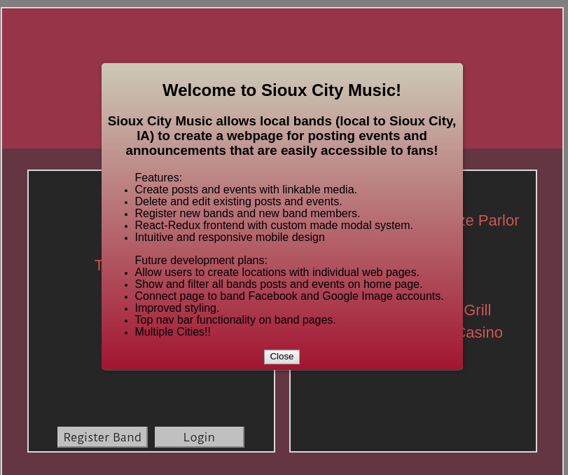

### Home Page:
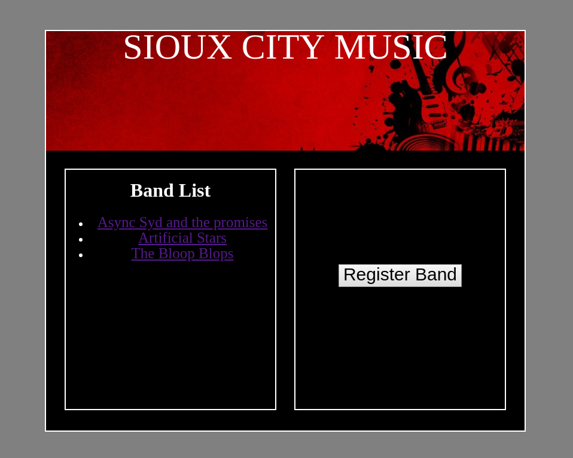

Venue links do not lead anywhere yet. Click a band, register a new band, or login to existing username.

### Band Registration:

### New Band Page:
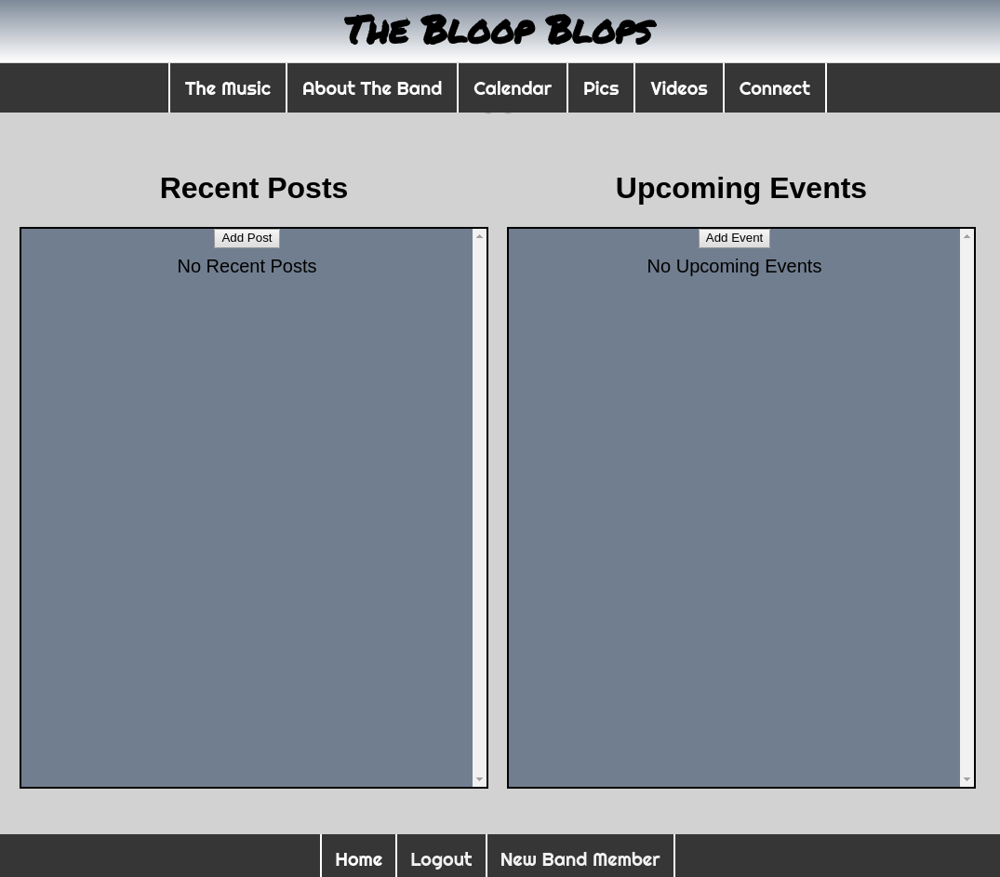

### Populated Band Page:
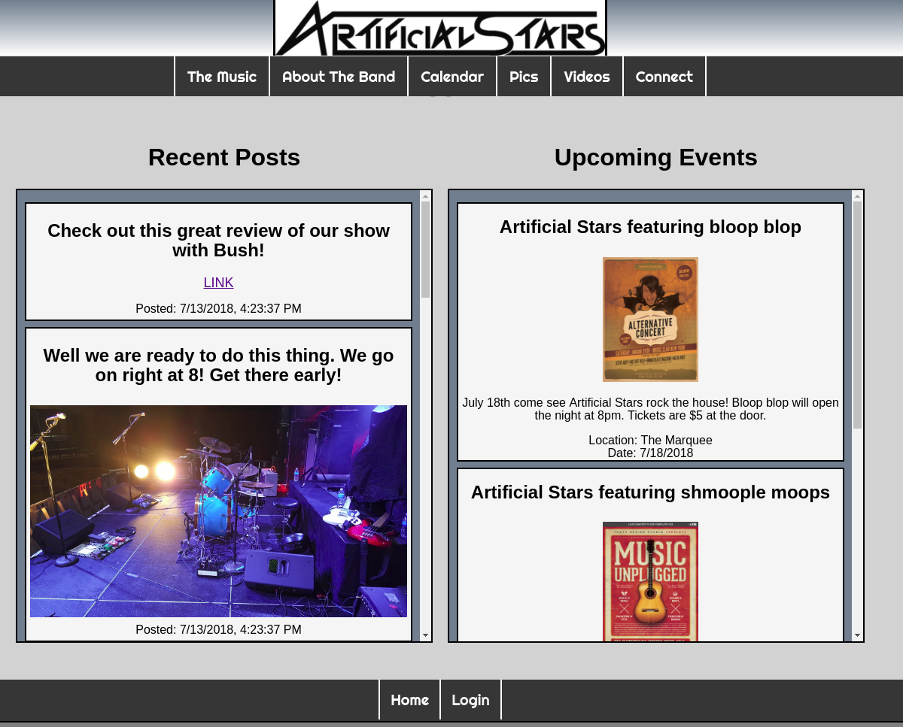

login for artificial stars is user: manny1806 password: thinkful

### Add Post:
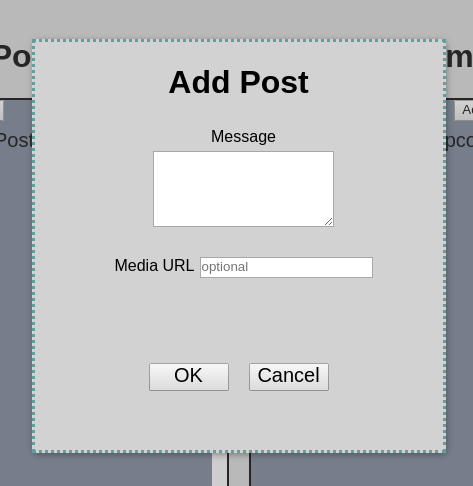

### Edit Post:
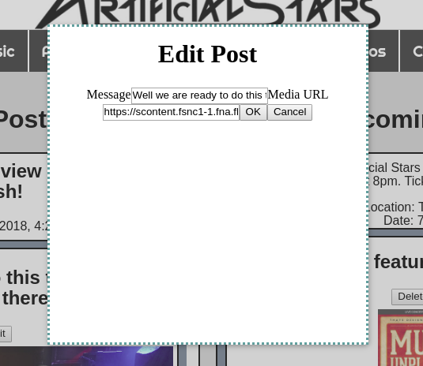

### Delete Post or Event:
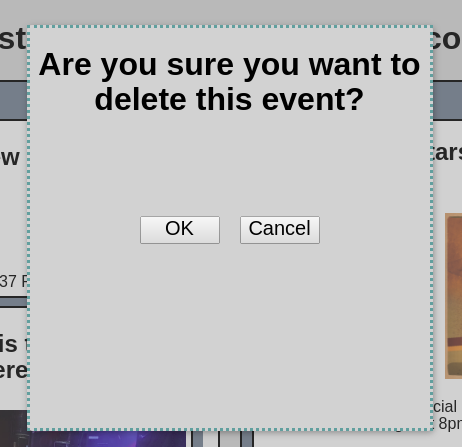

### Add Event:
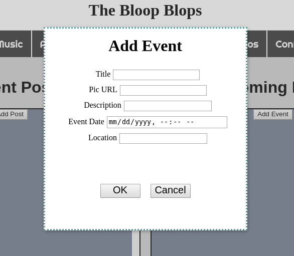

### Edit Event:
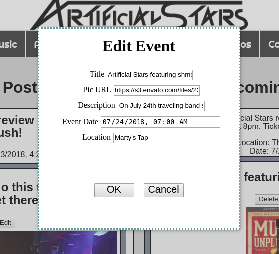

### Register New Band Member:
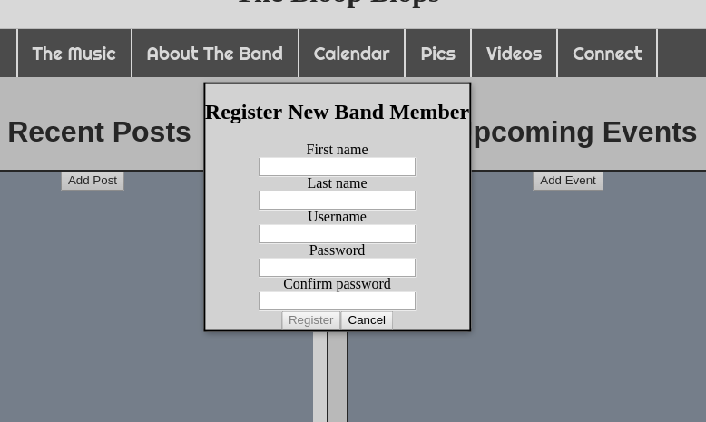

### Slick Mobile Design:
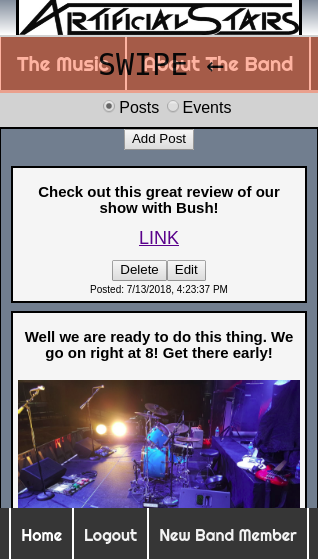
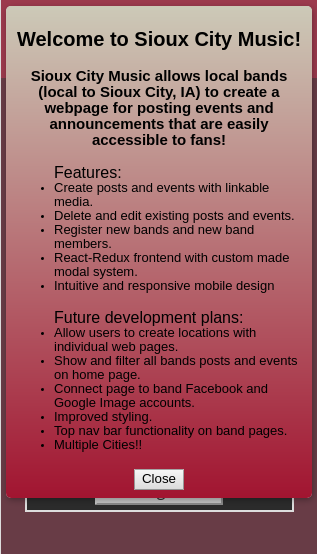

## Tech Stack:

    Client side of the app built using: 
    -HTML5 and CSS
    -JWT for validation
    -Redux for state management
    -Redux form for validation

    Server built using the following:
    -Express and Node.js
    -MongoDB for database
    -bcryptjs for encryption

## Key parts of the app

Actions: In src/actions

Components: In src/components

Reducers: In src/reducers

Store: Contains all reducers in a combine reducer (in store.js)

Modal System: modal.js src/components (for managing pop up menus)
